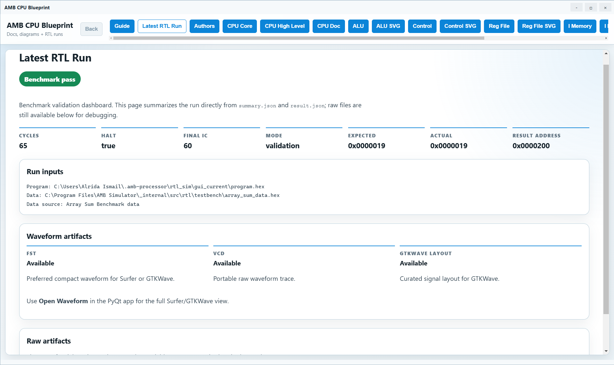
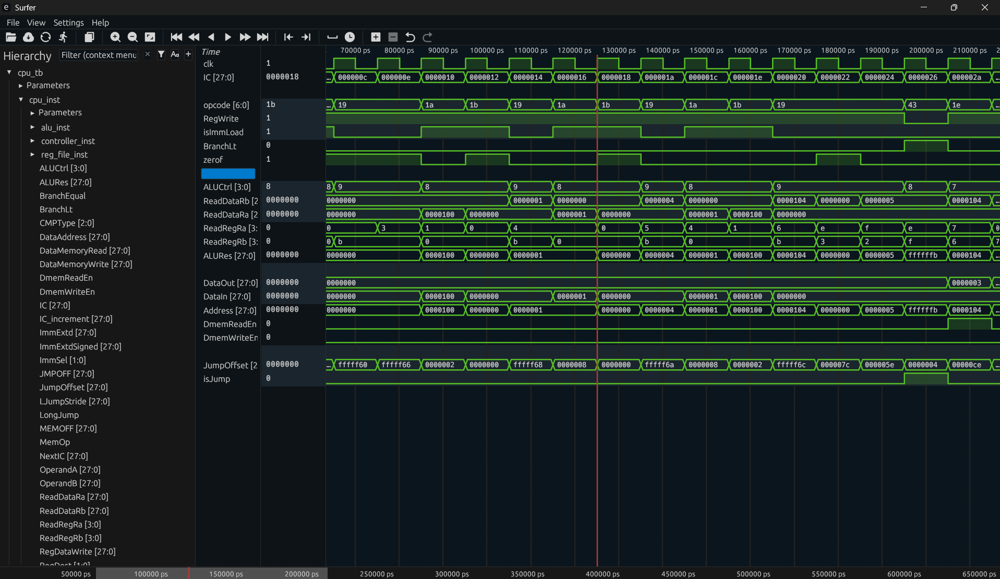

<div style="display: grid; grid-template-columns: minmax(0, 1fr) minmax(180px, 320px); column-gap: 48px; row-gap: 24px; align-items: center;">
  <div>
    <h1>AMB Processor</h1>
    <p><strong>A custom single-cycle CPU implemented in Verilog and compiled with LibreLane.</strong></p>
    <p>
      The AMB processor was designed and written in fulfillment of a UAEU group course project, in particular, for the
      <strong>Computer Architecture &amp; Organization: ELEC 462</strong> course, in fulfillment of our Bachelor of Science Degree
      in Electrical Engineering, under the teaching of
      <a href="https://www.linkedin.com/in/abdul-halim-jallad-72116141/">Dr. Abdulhalim Jallad</a>.
    </p>

  </div>
  <div style="align-items: center;">
    
  </div>
</div>

<div align="center" style="margin-top: 28px;">
  <p>
    <a href="docs/ISA_rtl_reference.md">ISA Reference</a> ·
    <a href="docs/cpu_components/index.html">CPU Component Docs</a> ·
    <a href="src/asic/config.yaml">LibreLane Config</a>
  </p>
</div>

## Project Summary

We were tasked with architecting and designing a 28-bit word CPU, with 16-bit instructions with an unused MSB, byte-addressable memory, and our own custom instruction set architecture.

And that is exactly what the repository is. Here, you will find our Verilog implementation of the CPU, a simulator written with PyQt6, as well as the GDS file generated with LibreLane for an ASIC implementation of the processor.

## Using The AMB Simulator

Download the latest AMB Assembler release for your platform from the repository's Releases page. On macOS, the app is currently unsigned and not notarized; if Gatekeeper blocks the first launch, approve it from System Settings > Privacy & Security and open it again.

Upon launching the app, you will be greeted with this:

<figure style="margin: 28px auto; text-align: center;">
  
  <figcaption style="margin-top: 8px; font-size: 0.85em; text-align: center;">
     The AMB Simulator editor page (it's pretty cool)
  </figcaption>
</figure>

A full text editor to write assembly instructions to run on the CPU, with syntax auto-complete, save/load of assembly files, step-through execution, as well as buttons to run the code on the simulated hardware with Icarus Verilog.

To run the simulated program using the Python assembler, hit **Assemble** then **Run**, which will show you how your code interacts with the memory and registers as it steps through your code. 

However, if you want to see the waveforms of the actual (simulated) hardware, first, be sure to load a **data memory image** hexadecimal file from the **RTL Options** button. The app will fall back to a default empty memory image” if you don't upload anything; we provide you with two memory images: one empty memory image (all zeros), and one for the array sum benchmark code.

 Having loaded your data memory, you can then click on **Assemble** then **Run RTL Sim** and finally after the result pop-up window shows up like this:

<figure style="margin: 28px auto; text-align: center;">
  
  <figcaption style="margin-top: 8px; font-size: 0.85em; text-align: center;">
    The array sum benchmark simulation report
  </figcaption>
</figure>

You can then click on the **Open Waveform** button to launch [Surfer](https://surfer-project.org/) to view the waveforms of the CPU.

<figure style="margin: 28px auto; text-align: center;">
  
  <figcaption style="margin-top: 8px; font-size: 0.85em; text-align: center;">
    The array sum benchmark code as a waveform in surfer
  </figcaption>
</figure>


This works for any program you write in the editor, so happy coding!

## Building the CPU with LibreLane Yourself

This workflow assumes you're using Ubuntu, and if you're a Windows user, there is always [WSL2 Ubuntu](https://learn.microsoft.com/en-us/windows/wsl/install) to get yourself started.

First, be sure to have [LibreLane](https://librelane.readthedocs.io/) installed, and follow the steps to set it up.

After having done that, open a new terminal and enter the Nix development shell for LibreLane, then run the thing using the repo's ASIC config:

```bash
# If you don't have Ubuntu setup, I highly recommend using it for this !
cd /path/to/librelane
nix develop
python3 -m librelane --pdk-root /path/to/pdk-root /path/to/amb-processor/src/asic/config.yaml
```

For the outputs we [published](src/asic/runs/RUN_2026-06-04_13-02-11/final), and used the Skywater130 process' PDK.

Some useful output files you might want to inspect after running LibreLane:

- [The CPU's GDS layout](src/asic/runs/RUN_2026-06-04_13-02-11/final/gds/cpu.gds)
- [The CPU's LEF physical interface](src/asic/runs/RUN_2026-06-04_13-02-11/final/lef/cpu.lef)
- [The CPU's synthesized netlist](src/asic/runs/RUN_2026-06-04_13-02-11/final/nl/cpu.nl.v)
- [The CPU's placed-and-routed netlist](src/asic/runs/RUN_2026-06-04_13-02-11/final/pnl/cpu.pnl.v)
- [The CPU's timing constraints](src/asic/runs/RUN_2026-06-04_13-02-11/final/sdc/cpu.sdc)
- [The CPU's SPICE extraction](src/asic/runs/RUN_2026-06-04_13-02-11/final/spice/cpu.spice)
- [The CPU's final metrics](src/asic/runs/RUN_2026-06-04_13-02-11/final/metrics.csv)

## CPU Architecture

The full generated component documentation is available in the [CPU Component Docs](docs/cpu_components/index.html). The core RTL modules are:

- [CPU Core](docs/cpu_components/cpu.md)
- [Control Unit](docs/cpu_components/control_unit.md)
- [Register File](docs/cpu_components/reg_file.md)
- [ALU](docs/cpu_components/alu.md)
- [Instruction Memory](docs/cpu_components/i_memory.md)
- [Data Memory](docs/cpu_components/d_memory.md)
