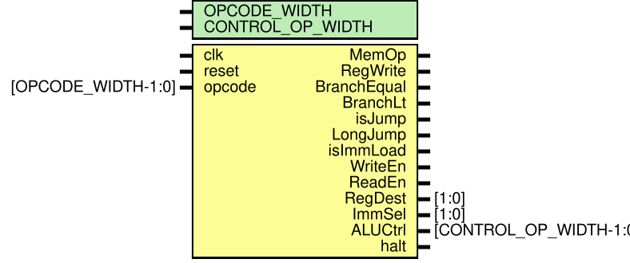

<div align="center">
  
  <h1>The AMB Processor</h1>
  <p><strong>A custom single-cycle CPU implemented in Verilog and compiled with LibreLane.</strong></p>
  <p>
    <a href="docs/ISA_rtl_reference.md">ISA Reference</a> ·
    <a href="docs/cpu_components/index.html">CPU Component Docs</a> ·
    <a href="src/asic/config.yaml">LibreLane Config</a>
  </p>
</div>

The AMB processor was designed and written in fulfillment of a UAEU group course project, in particular, for the **Computer Architecture \& Organization: ELEC 462** course, in fulfillment of our Bachelor of Science Degree in Electrical Engineering, under the teaching of [Dr. Abdulhalim Jallad](https://www.linkedin.com/in/abdul-halim-jallad-72116141/).

## Problem Statemnt \& Repo Summary

We were tasked with de

## Building the CPU with LibreLane

This workflow assumes you're working on the repo from Ubuntu, and if you're a windows user, there is always [WSL2 Ubuntu](link/to/wsl2/ubuntu/setup) to get yourself started. 

First, be sure to have [LibreLane](link/to/librelane/docs) installed, and follow the steps to set it up.

After having done that, open a new terminal and enter the Nix development shell for LibreLane, then run the thing using the repo's ASIC config:

```bash
# If you don't have ubuntu setup, I highly recommend using it for this !
cd /path/to/librelane
nix develop
python3 -m librelane --pdk-root /path/to/pdk-root /path/to/amb-processor/src/asic/config.yaml
```

For the outputs I [published](path/to/build/output), I used the Skywater130 process' PDK.

Some useful file links you might want to take a look at after running LibreLane:

```text
src/asic/runs/<RUN_TAG>/final/gds/cpu.gds
src/asic/runs/<RUN_TAG>/final/lef/cpu.lef
src/asic/runs/<RUN_TAG>/final/nl/cpu.nl.v
src/asic/runs/<RUN_TAG>/final/pnl/cpu.pnl.v
src/asic/runs/<RUN_TAG>/final/sdc/cpu.sdc
src/asic/runs/<RUN_TAG>/final/spice/cpu.spice
src/asic/runs/<RUN_TAG>/final/metrics.csv
```

- [The CPU's GDS output](src/asic/runs/RUN_2026-06-04_13-02-11/final/gds/cpu.gds)
- [The CPU's final metrics](src/asic/runs/RUN_2026-06-04_13-02-11/final/metrics.csv)

## CPU Architecture

The AMB processor is documented below directly from the component references. The browsable HTML/SVG documentation hub is available at [docs/cpu_components/index.html](docs/cpu_components/index.html).

## CPU Core


# Entity: cpu 
- **File**: cpu.v

## Diagram

## Description

Single-cycle AMB CPU core that connects instruction fetch, decode, register file, ALU, and external data memory buses.

## Generics

| Generic name              | Type | Value | Description                                                            |
| ------------------------- | ---- | ----- | ---------------------------------------------------------------------- |
| DATA_ADDR_SPACE           |      | 28    | Width of byte addresses used on the external data memory interface.    |
| DATA_WORD_WIDTH           |      | 28    | Width of architectural data words.                                     |
| INSTRUCTION_WIDTH         |      | 16    | Stored instruction width. Bit 15 is unused by the 15-bit ISA encoding. |
| INSTRUCTION_ADDRESS_SPACE |      | 28    | Width of byte addresses used by the instruction counter.               |
| REG_ADDR_WIDTH            |      | 4     | Number of selector bits used to address one architectural register.    |
| NUM_OF_REGS               |      | 16    | Number of architectural register slots.                                |

## Ports

| Port name       | Direction | Type                            | Description                                                         |
| --------------- | --------- | ------------------------------- | ------------------------------------------------------------------- |
| clk             | input     |                                 | Rising-edge CPU clock.                                              |
| reset           | input     |                                 | Active-high reset for the instruction counter and register file.    |
| halt            | output    |                                 | Asserted when the decoded instruction is HLT.                       |
| IC              | output    | [INSTRUCTION_ADDRESS_SPACE-1:0] | Current byte address presented to instruction memory.               |
| instr           | input     | [INSTRUCTION_WIDTH-1:0]         | Instruction word returned by instruction memory for the current IC. |
| DataAddress     | output    | [DATA_ADDR_SPACE-1:0]           | Byte address presented to external data memory.                     |
| DataMemoryWrite | output    | [DATA_WORD_WIDTH-1:0]           | Data word presented to external data memory on stores.              |
| DataMemoryRead  | input     | [DATA_WORD_WIDTH-1:0]           | Data word returned by external data memory on loads.                |
| DmemReadEn      | output    |                                 | Data memory read enable asserted for LOAD.                          |
| DmemWriteEn     | output    |                                 | Data memory write enable asserted for STOR.                         |

## Signals

| Name          | Type                       | Description                                                                           |
| ------------- | -------------------------- | ------------------------------------------------------------------------------------- |
| ZR            | wire [DATA_WORD_WIDTH-1:0] | Constant zero word used by mux defaults and reset paths.                              |
| WillBranch    | reg                        | Selects branch/jump IC update when high, otherwise selects sequential IC+2.           |
| RegDataWrite  | reg [DATA_WORD_WIDTH-1:0]  | Writeback data selected from data memory, ALU result, immediate byte, or zero.        |
| IC_increment  | wire [DATA_WORD_WIDTH-1:0] | Amount added to IC this cycle.                                                        |
| NextIC        | wire [DATA_WORD_WIDTH-1:0] | Next IC value before the IC register captures it.                                     |
| JumpOffset    | wire [DATA_WORD_WIDTH-1:0] | Signed jump stride after immediate/JMPOFF selection and instruction-word scaling.     |
| LJumpStride   | wire [DATA_WORD_WIDTH-1:0] | Optional long-jump base offset selected from JMPOFF.                                  |
| MEMOFF        | wire [DATA_WORD_WIDTH-1:0] | Current MEMOFF register value used as the memory base offset.                         |
| JMPOFF        | wire [DATA_WORD_WIDTH-1:0] | Current JMPOFF register value used by long jump forms.                                |
| OperandA      | wire [DATA_WORD_WIDTH-1:0] | ALU operand A selected from Ra data or MEMOFF during memory operations.               |
| OperandB      | wire [DATA_WORD_WIDTH-1:0] | ALU operand B sourced from Rb data.                                                   |
| ALURes        | wire [DATA_WORD_WIDTH-1:0] | Combinational ALU result used for writeback, data address, and branch compare result. |
| ImmExtd       | wire [DATA_WORD_WIDTH-1:0] | Zero-extended instruction imm8 field.                                                 |
| ImmExtdSigned | wire [DATA_WORD_WIDTH-1:0] | Sign-extended instruction imm8 field.                                                 |
| ReadDataRb    | wire [DATA_WORD_WIDTH-1:0] | Register file read data for Rb/source selector.                                       |
| ReadDataRa    | wire [DATA_WORD_WIDTH-1:0] | Register file read data for Ra/destination selector.                                  |
| opcode        | wire [6:0]                 | Decoded seven-bit opcode field from instr[14:8].                                      |
| ReadRegRb     | wire [3:0]                 | Register file Rb/source read selector.                                                |
| ReadRegRa     | wire [3:0]                 | Register file Ra/destination read selector.                                           |
| WriteReg      | wire [3:0]                 | Register file write selector.                                                         |
| RegWrite      | wire                       | Enables register file writes for register-producing instructions.                     |
| MemOp         | wire                       | Selects memory address operand mode for LOAD/STOR.                                    |
| LongJump      | wire                       | Enables JMPOFF participation in jump offset calculation.                              |
| isJump        | wire                       | Identifies J-type opcodes.                                                            |
| BranchEqual   | wire                       | Enables equality branch decision for JPEQ.                                            |
| BranchLt      | wire                       | Enables less-than branch decision for JPBLW.                                          |
| isImmLoad     | wire                       | Identifies LIL/LIH/LILL/LIHH immediate assembly instructions.                         |
| zerof         | wire                       | ALU equality flag used by JPEQ.                                                       |
| altb          | wire                       | ALU less-than flag used by JPBLW.                                                     |
| ALUCtrl       | wire [3:0]                 | ALU operation selector generated by the controller.                                   |
| ImmSel        | wire [1:0]                 | Immediate lane selector for IMR writes in the register file.                          |
| CMPType       | wire [2:0]                 | Packed branch decision type: {isJump, BranchEqual, BranchLt}.                         |
| RegDest       | wire [1:0]                 | Register writeback source selector.                                                   |

## Constants

| Name      | Type | Value   | Description                                            |
| --------- | ---- | ------- | ------------------------------------------------------ |
| IMR_ADDR  |      | 4'b1011 | Register selector for the immediate assembly register. |
| CMPA_ADDR |      | 4'b1110 | Register selector for the first compare operand.       |
| CMPB_ADDR |      | 4'b1111 | Register selector for the second compare operand.      |

## Processes
- branch_logic: ( @(*) )
  - **Type:** always
  - **Description**
  Combines jump and conditional branch control bits into one branch decision selector.  Extracts the opcode field from the current instruction.  Extends imm8 as an unsigned value for IMR lane writes.  Extends imm8 as a signed value for PC-relative jump offsets.  Selects JMPOFF only for long jump forms; direct JMP uses zero base.  Calculates byte offset for jump instructions from signed imm8 plus optional JMPOFF.  Selects whether the current instruction branches unconditionally, conditionally, or not at all. 
- instruction_counter_update: ( @(posedge clk or posedge reset) )
  - **Type:** always
  - **Description**
  Selects sequential IC increment or branch/jump offset.  Adds the selected increment to the current IC.  Updates the instruction counter on each active clock edge unless halted. 
- register_writeback_data_select: ( @(*) )
  - **Type:** always
  - **Description**
  Selects CMPB for branch compare instructions, otherwise instr[7:4].  Selects CMPA for branch compare instructions, otherwise instr[3:0].  Directs immediate loads into IMR, otherwise writes the Ra selector.  Selects MEMOFF as operand A for memory address calculation, otherwise Ra data.  Provides Rb data as operand B for ALU and memory address calculation.  Drives the external data memory byte address from the ALU result.  Drives store data from Ra read data.  Selects the data source written back into the register file. 

## Instantiations

- reg_file_inst: reg_file
  -  Architectural register file instance with IMR lane write support.- alu_inst: alu
  -  Combinational ALU instance used for arithmetic, moves, compares, and memory address generation.- controller_inst: controller
  -  Instruction decoder and control signal generator.
## Control Unit


# Entity: controller 
- **File**: control_unit.v

## Diagram

## Description

Combinational decoder that maps ISA v1 opcodes into CPU datapath control signals.

## Generics

| Generic name     | Type | Value | Description                          |
| ---------------- | ---- | ----- | ------------------------------------ |
| OPCODE_WIDTH     |      | 7     | Width of the ISA opcode field.       |
| CONTROL_OP_WIDTH |      | 4     | Width of the ALU operation selector. |

## Ports

| Port name   | Direction | Type                   | Description                                                         |
| ----------- | --------- | ---------------------- | ------------------------------------------------------------------- |
| clk         | input     |                        | Clock carried for module contract symmetry with the CPU datapath.   |
| reset       | input     |                        | Reset carried for module contract symmetry with the CPU datapath.   |
| opcode      | input     | [OPCODE_WIDTH-1:0]     | Current instruction opcode from instr[14:8].                        |
| MemOp       | output    |                        | Selects memory address generation mode in the CPU ALU operand path. |
| RegWrite    | output    |                        | Enables writes into the register file.                              |
| BranchEqual | output    |                        | Marks JPEQ as the active branch comparison.                         |
| BranchLt    | output    |                        | Marks JPBLW as the active branch comparison.                        |
| isJump      | output    |                        | Asserted for opcodes in the jump opcode space.                      |
| LongJump    | output    |                        | Asserted for jump forms that add JMPOFF to the signed imm8 offset.  |
| isImmLoad   | output    |                        | Asserted for LIL, LIH, LILL, and LIHH.                              |
| WriteEn     | output    |                        | Data memory write enable asserted for STOR.                         |
| ReadEn      | output    |                        | Data memory read enable asserted for LOAD.                          |
| RegDest     | output    | [1:0]                  | Register writeback source selector.                                 |
| ImmSel      | output    | [1:0]                  | IMR lane selector used by immediate load instructions.              |
| ALUCtrl     | output    | [CONTROL_OP_WIDTH-1:0] | ALU operation selector.                                             |
| halt        | output    |                        | Halt flag asserted for HLT.                                         |

## Signals

| Name  | Type | Description                                                              |
| ----- | ---- | ------------------------------------------------------------------------ |
| RTYPE | wire | True when the current opcode is one of the register-register operations. |

## Constants

| Name    | Type | Value      | Description                                    |
| ------- | ---- | ---------- | ---------------------------------------------- |
| set     |      | 1'b1       | Canonical asserted control value.              |
| unset   |      | 1'b0       | Canonical deasserted control value.            |
| HALT    |      | 7'b0000000 | HLT opcode.                                    |
| NOP     |      | 7'b0000001 | NOP opcode.                                    |
| NOT     |      | 7'b0010000 | NOT opcode.                                    |
| OR      |      | 7'b0010001 | OR opcode.                                     |
| AND     |      | 7'b0010010 | AND opcode.                                    |
| XOR     |      | 7'b0010011 | XOR opcode.                                    |
| SHL     |      | 7'b0010100 | SHL opcode.                                    |
| SHR     |      | 7'b0010101 | SHR opcode.                                    |
| SAR     |      | 7'b0010110 | SAR opcode.                                    |
| ADD     |      | 7'b0010111 | ADD opcode.                                    |
| SUB     |      | 7'b0011000 | SUB opcode.                                    |
| MOV     |      | 7'b0011001 | MOV opcode.                                    |
| LIL     |      | 7'b0011010 | LIL opcode for IMR[7:0].                       |
| LIH     |      | 7'b0011011 | LIH opcode for IMR[15:8].                      |
| LILL    |      | 7'b0011100 | LILL opcode for IMR[23:16].                    |
| LIHH    |      | 7'b0011101 | LIHH opcode for IMR[27:24].                    |
| LOAD    |      | 7'b0011110 | LOAD opcode.                                   |
| STOR    |      | 7'b0011111 | STOR opcode.                                   |
| JMP     |      | 7'b1000000 | Direct PC-relative jump opcode.                |
| JMPL    |      | 7'b1000001 | Long PC-relative jump opcode using JMPOFF.     |
| JPEQ    |      | 7'b1000010 | Conditional equal jump opcode using CMPA/CMPB. |
| JPBLW   |      | 7'b1000011 | Conditional below jump opcode using CMPA/CMPB. |
| ALU_NOT |      | 4'b0000    | ALU selector for NOT.                          |
| ALU_OR  |      | 4'b0001    | ALU selector for OR.                           |
| ALU_AND |      | 4'b0010    | ALU selector for AND.                          |
| ALU_XOR |      | 4'b0011    | ALU selector for XOR.                          |
| ALU_SHL |      | 4'b0100    | ALU selector for SHL.                          |
| ALU_SHR |      | 4'b0101    | ALU selector for SHR.                          |
| ALU_SAR |      | 4'b0110    | ALU selector for SAR.                          |
| ALU_ADD |      | 4'b0111    | ALU selector for ADD.                          |
| ALU_SUB |      | 4'b1000    | ALU selector for SUB.                          |
| ALU_MOV |      | 4'b1001    | ALU selector for MOV.                          |

## Processes
- memory_operation_decode: ( @(*) )
  - **Type:** always
  - **Description**
  Range decode for register-register ALU and MOV opcodes.  Decodes LOAD/STOR as memory operations. 
- register_write_decode: ( @(*) )
  - **Type:** always
  - **Description**
  Enables register writes for instructions that produce architectural register data. 
- branch_equal_decode: ( @(*) )
  - **Type:** always
  - **Description**
  Decodes JPEQ equality-branch intent. 
- branch_less_than_decode: ( @(*) )
  - **Type:** always
  - **Description**
  Decodes JPBLW less-than-branch intent. 
- jump_class_decode: ( @(*) )
  - **Type:** always
  - **Description**
  Decodes the jump opcode space. 
- long_jump_decode: ( @(*) )
  - **Type:** always
  - **Description**
  Enables JMPOFF for JMPL and conditional branch opcodes. 
- immediate_load_decode: ( @(*) )
  - **Type:** always
  - **Description**
  Decodes immediate assembly instructions that write IMR lanes. 
- data_memory_write_decode: ( @(*) )
  - **Type:** always
  - **Description**
  Generates the data memory write strobe. 
- data_memory_read_decode: ( @(*) )
  - **Type:** always
  - **Description**
  Generates the data memory read strobe. 
- register_writeback_source_select: ( @(*) )
  - **Type:** always
  - **Description**
  Selects register writeback source: memory, ALU, immediate byte, or zero. 
- immediate_lane_select: ( @(*) )
  - **Type:** always
  - **Description**
  Selects which byte lane of IMR receives the current imm8 value. 
- alu_control_decode: ( @(*) )
  - **Type:** always
  - **Description**
  Maps the current opcode to the ALU operation selector. 
- halt_decode: ( @(*) )
  - **Type:** always
  - **Description**
  Decodes HLT into the core halt signal. 

## Register File


# Entity: reg_file 
- **File**: reg_file.v

## Diagram

## Description

Sixteen-slot architectural register file with asynchronous reads and synchronous writes.

## Generics

| Generic name    | Type | Value | Description                                       |
| --------------- | ---- | ----- | ------------------------------------------------- |
| DATA_WORD_WIDTH |      | 28    | Width of each register word.                      |
| ADDR_WIDTH      |      | 4     | Width of each register selector.                  |
| NUM_OF_REGS     |      | 16    | Number of register slots implemented by the file. |

## Ports

| Port name  | Direction | Type                  | Description                                                 |
| ---------- | --------- | --------------------- | ----------------------------------------------------------- |
| clk        | input     |                       | Rising-edge clock for register writes.                      |
| reset      | input     |                       | Active-high reset that clears all register slots.           |
| halt       | input     |                       | Halt input that blocks further writes when asserted.        |
| ReadAddrRb | input     | [ADDR_WIDTH-1:0]      | Source register selector for Rb.                            |
| ReadAddrRa | input     | [ADDR_WIDTH-1:0]      | Destination register selector for Ra.                       |
| WriteAddr  | input     | [ADDR_WIDTH-1:0]      | Register selector targeted by the writeback port.           |
| WriteData  | input     | [DATA_WORD_WIDTH-1:0] | Data presented to the writeback port.                       |
| RegWrite   | input     |                       | Write enable for the writeback port.                        |
| ReadDataRb | output    | [DATA_WORD_WIDTH-1:0] | Asynchronous read data for Rb.                              |
| ReadDataRa | output    | [DATA_WORD_WIDTH-1:0] | Asynchronous read data for Ra.                              |
| MEMOFF_OUT | output    | [DATA_WORD_WIDTH-1:0] | Current MEMOFF register value exported to the CPU datapath. |
| JMPOFF_OUT | output    | [DATA_WORD_WIDTH-1:0] | Current JMPOFF register value exported to the CPU datapath. |
| ImmSel     | input     | [1:0]                 | IMR byte-lane selector for immediate assembly writes.       |

## Signals

| Name                       | Type                      | Description                                           |
| -------------------------- | ------------------------- | ----------------------------------------------------- |
| i                          | integer                   | Loop index used when reset clears the register array. |
| registry [0:NUM_OF_REGS-1] | reg [DATA_WORD_WIDTH-1:0] | Backing storage for all architectural register slots. |

## Constants

| Name   | Type | Value   | Description                                                |
| ------ | ---- | ------- | ---------------------------------------------------------- |
| R0     |      | 4'b0000 | Register selector for general register R0.                 |
| R1     |      | 4'b0001 | Register selector for general register R1.                 |
| R2     |      | 4'b0010 | Register selector for general register R2.                 |
| R3     |      | 4'b0011 | Register selector for general register R3.                 |
| R4     |      | 4'b0100 | Register selector for general register R4.                 |
| R5     |      | 4'b0101 | Register selector for general register R5.                 |
| R6     |      | 4'b0110 | Register selector for general register R6.                 |
| R7     |      | 4'b0111 | Register selector for general register R7.                 |
| R8     |      | 4'b1000 | Register selector for the instruction counter mirror slot. |
| SP     |      | 4'b1001 | Register selector for the stack pointer slot.              |
| LC     |      | 4'b1010 | Register selector for the loop counter slot.               |
| IMR    |      | 4'b1011 | Register selector for the immediate assembly register.     |
| JMPOFF |      | 4'b1100 | Register selector for the long-jump base offset.           |
| MEMOFF |      | 4'b1101 | Register selector for the memory base offset.              |
| CMPA   |      | 4'b1110 | Register selector for the first compare operand.           |
| CMPB   |      | 4'b1111 | Register selector for the second compare operand.          |

## Processes
- asynchronous_register_read: ( @(*) )
  - **Type:** always
  - **Description**
  Asynchronously reads the selected Ra and Rb register slots. 
- synchronous_register_write: ( @(posedge clk or posedge reset) )
  - **Type:** always
  - **Description**
  Exposes MEMOFF directly for memory address generation.  Exposes JMPOFF directly for long jump address generation.  Synchronously clears registers on reset and writes either a full register or an IMR lane. 

## ALU


# Entity: alu 
- **File**: alu.v

## Diagram

## Description

Combinational arithmetic logic unit for ISA v1 register operations, moves, shifts, and comparisons.

## Generics

| Generic name     | Type | Value | Description                                |
| ---------------- | ---- | ----- | ------------------------------------------ |
| DATA_WORD_WIDTH  |      | 28    | Width of each ALU operand and result word. |
| CONTROL_OP_WIDTH |      | 4     | Width of the ALU operation selector.       |

## Ports

| Port name | Direction | Type                   | Description                                                                      |
| --------- | --------- | ---------------------- | -------------------------------------------------------------------------------- |
| clk       | input     |                        | Clock carried for module contract symmetry with the CPU datapath.                |
| reset     | input     |                        | Reset carried for module contract symmetry with the CPU datapath.                |
| halt      | input     |                        | Halt carried for module contract symmetry with the CPU datapath.                 |
| OperandA  | input     | [DATA_WORD_WIDTH-1:0]  | First ALU operand, normally Ra data or MEMOFF during memory address calculation. |
| OperandB  | input     | [DATA_WORD_WIDTH-1:0]  | Second ALU operand, normally Rb/source data.                                     |
| ALUCtrl   | input     | [CONTROL_OP_WIDTH-1:0] | Operation selector generated by the controller.                                  |
| result    | output    | [DATA_WORD_WIDTH-1:0]  | Combinational result for the selected ALU operation.                             |
| zero      | output    |                        | Equality flag asserted when OperandA equals OperandB.                            |
| altb      | output    |                        | Unsigned less-than flag asserted when OperandA is below OperandB.                |

## Constants

| Name    | Type | Value   | Description                                  |
| ------- | ---- | ------- | -------------------------------------------- |
| ALU_NOT |      | 4'b0000 | Operation code for bitwise inversion.        |
| ALU_OR  |      | 4'b0001 | Operation code for bitwise OR.               |
| ALU_AND |      | 4'b0010 | Operation code for bitwise AND.              |
| ALU_XOR |      | 4'b0011 | Operation code for bitwise XOR.              |
| ALU_SHL |      | 4'b0100 | Operation code for logical left shift.       |
| ALU_SHR |      | 4'b0101 | Operation code for logical right shift.      |
| ALU_SAR |      | 4'b0110 | Operation code for arithmetic right shift.   |
| ALU_ADD |      | 4'b0111 | Operation code for addition.                 |
| ALU_SUB |      | 4'b1000 | Operation code for subtraction.              |
| ALU_MOV |      | 4'b1001 | Operation code for MOV, forwarding OperandB. |

## Processes
- operation_select: ( @(*) )
  - **Type:** always
  - **Description**
  Computes the selected ALU operation and updates comparison flags. 

## Instruction Memory


# Entity: imem 
- **File**: i_memory.v

## Diagram

## Description

Byte-addressed instruction memory model with asynchronous instruction fetch.

## Generics

| Generic name              | Type | Value | Description                                      |
| ------------------------- | ---- | ----- | ------------------------------------------------ |
| INSTRUCTION_WIDTH         |      | 16    | Width of each returned instruction word.         |
| INSTRUCTION_ADDRESS_SPACE |      | 28    | Width of the instruction byte address bus.       |
| DEPTH                     |      | 4096  | Number of addressable bytes in the memory image. |

## Ports

| Port name | Direction | Type                            | Description                                                                |
| --------- | --------- | ------------------------------- | -------------------------------------------------------------------------- |
| clk       | input     |                                 | Clock carried for contract symmetry with the CPU core.                     |
| reset     | input     |                                 | Reset carried for contract symmetry; memory contents are not cleared here. |
| halt      | input     |                                 | Halt carried for contract symmetry with the CPU core.                      |
| IC        | input     | [INSTRUCTION_ADDRESS_SPACE-1:0] | Byte address of the instruction to fetch.                                  |
| instr     | output    | [INSTRUCTION_WIDTH-1:0]         | Instruction word assembled from two adjacent bytes.                        |

## Signals

| Name                | Type         | Description                                                 |
| ------------------- | ------------ | ----------------------------------------------------------- |
| imemory [0:DEPTH-1] | reg [7:0]    | Byte-addressed instruction storage loaded from program hex. |
| program_hex         | reg [1023:0] | Runtime path to the program hex image.                      |

## Processes
- asynchronous_instruction_fetch: ( @(*) )
  - **Type:** always
  - **Description**
  Asynchronously returns the 16-bit instruction at the current byte address. 

## Data Memory


# Entity: dmem 
- **File**: d_memory.v

## Diagram

## Description

Byte-addressed data memory model with asynchronous reads and synchronous writes.

## Generics

| Generic name    | Type | Value | Description                                           |
| --------------- | ---- | ----- | ----------------------------------------------------- |
| DATA_ADDR_SPACE |      | 28    | Width of the data byte address bus.                   |
| DATA_WORD_WIDTH |      | 28    | Width of each architectural data word.                |
| DEPTH           |      | 4096  | Number of addressable bytes in the data memory image. |

## Ports

| Port name | Direction | Type                  | Description                                                                |
| --------- | --------- | --------------------- | -------------------------------------------------------------------------- |
| clk       | input     |                       | Rising-edge clock for memory writes.                                       |
| reset     | input     |                       | Reset carried for contract symmetry; memory contents are not cleared here. |
| halt      | input     |                       | Halt input that blocks writes when asserted.                               |
| Address   | input     | [DATA_ADDR_SPACE-1:0] | Byte address used for the current read or write.                           |
| DataIn    | input     | [DATA_WORD_WIDTH-1:0] | Data word written to memory on stores.                                     |
| DataOut   | output    | [DATA_WORD_WIDTH-1:0] | Data word read from memory on loads.                                       |
| ReadEn    | input     |                       | Enables the asynchronous read output.                                      |
| WriteEn   | input     |                       | Enables a synchronous memory write.                                        |

## Signals

| Name                | Type         | Description                                       |
| ------------------- | ------------ | ------------------------------------------------- |
| dmemory [0:DEPTH-1] | reg [7:0]    | Byte-addressed data storage loaded from data hex. |
| data_hex            | reg [1023:0] | Runtime path to the data hex image.               |

## Processes
- asynchronous_data_read: ( @(*) )
  - **Type:** always
  - **Description**
  Asynchronously reads a 28-bit little-endian word when ReadEn is asserted. 
- synchronous_data_write: ( @(posedge clk) )
  - **Type:** always
  - **Description**
  Synchronously writes a 28-bit little-endian word when WriteEn is asserted. 
